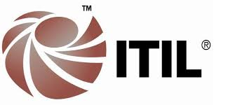
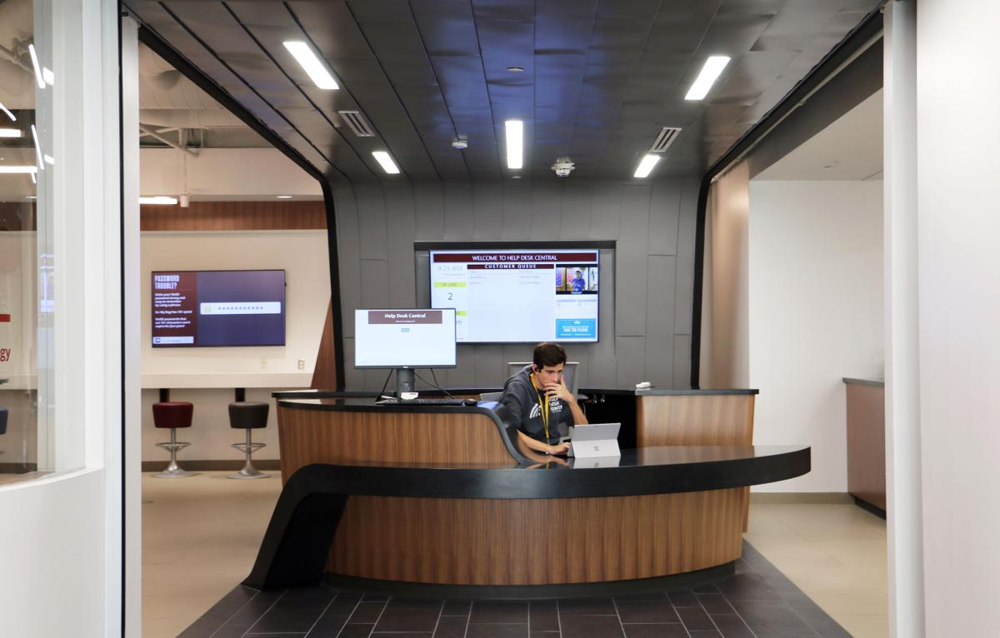

Starting back in the 1980’s, we can see the emergence of the first IT Service Management frameworks; most notably among these is the Information Technology Infrastructure Library (ITIL). 

The primary emphasis and evolution have come through the utilization of new and emerging technologies that shape the way people do all kinds of business. IT was an integral part of this evolution and has remained at the core of nearly every major business today. 

In addition to the implementation of technology, ITIL and the other driving standards within IT have placed a focus on the optimization of resources, which is often captured in the saying, “We must give the customers more value with fewer resources.” At the forefront of all this management and optimization lies the **IT help desk**. The IT help desk is often the single point of contact between the customers of IT services and the entity or organization that is offering those services. With that in mind, the help desk is placed in the unique position of being the only side of a company with whom many people interact. Throughout the history of the help desk, the technologies and methodologies that were used to provide service have changed greatly. 

Speaking not only of the industry at large but also of our own backyard, the Help Desk at Texas A&M has evolved through the decades to become the formidable institution of today. Its beginning started out small, as did many other help desks. However, through the implementation of an ever increasing infrastructure, a variety of technology, and the ITIL framework, Texas A&M’s help desk has become one of the largest and most prolific IT help desks in higher education. This website project explores many of those changes and some of the key components of each decade of the existence of the IT help desk.

