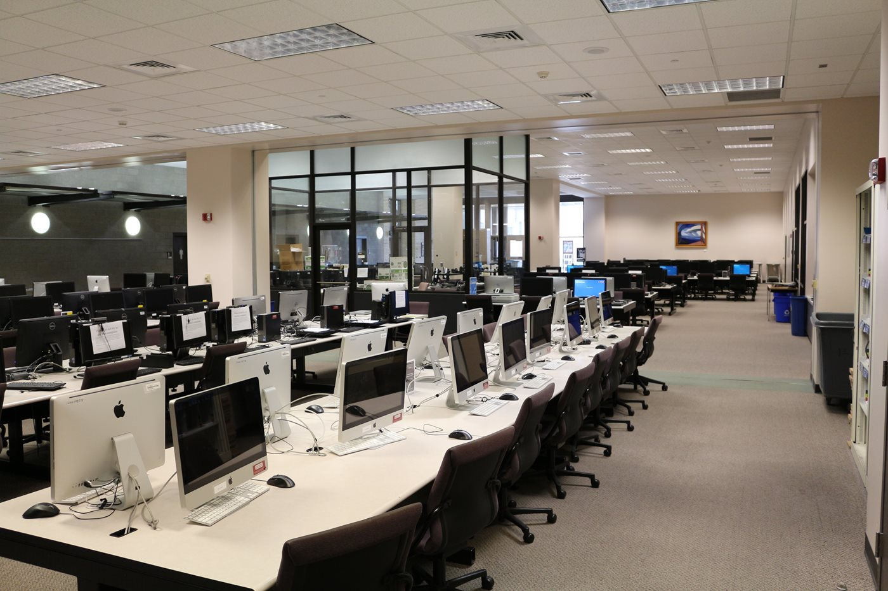

The 1990’s saw the growth of the ***IT call center***. Rather than spending weeks waiting for a mail-in ticket to be received and worked on, end user’s could simply call in and in many cases, receive their answer then and there. While it may seem like this is a simple upgrade to the old system, call centers presented a tidal wave of new and difficult problems. 

The foremost of these turned out to be volume management. All the people whose problem was too small to merit them mailing in a ticket, could now simply pick up the phone and get help. Most companies vastly underestimated the increase that this would cause in the sheer number of tickets generated. 

Suddenly, companies needed many more people to bear this new avenue of technical support. Many of these companies had snookered themselves into a no win situation; either they suffered a public relations hit or they took a major hit to their wallets. In a somewhat desperate attempt to have the best of both worlds, many companies outsourced their call centers overseas. However, due to their hurried attempts and lack of funding, many of these call centers could be considered a failure on both counts. 

Meanwhile at A&M, the IT infrastructure was really starting to take off. Computing labs started popping up around campus and many miniature help desks were planted at these labs. These help desks were not the big single point of contact that exists today, but rather they were distributed and contained more locally with the labs. They still reported back to a singular department, but they acted much more independently than what exists today. On the software side of things, instant messenger programs and email were gaining popularity on campus, which drove many people to use the still terminal-based labs.

